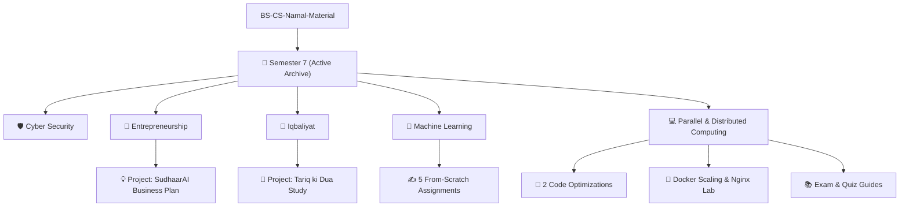

# 🎓 BS-CS-Namal-Material

Welcome to my academic repository! This repository serves as a comprehensive, structured archive of all labs, programming assignments, projects, exam study guides, and research materials that I have completed during my **Bachelor of Science in Computer Science (BS CS)** degree at **Namal University Mianwali**. 

The goal of this repository is to track my academic progression, showcase from-scratch implementations of complex computer science concepts (ranging from Machine Learning algorithms to distributed container orchestrations), and act as a detailed reference for junior students, recruiters, and peers.

---

## 📂 Repository Architecture

Below is the directory map of the repository, categorized by semester and coursework. You can click on any folder or course to view its dedicated documentation and code implementations.

---

## 🗂️ Semester Directory Directory

### 📅 [Semester 7](file:///c:/Users/abuba/OneDrive/Desktop/BS-CS-Namal-Material/Semester%207/README.md)
*Focus: Security, AI/ML, Parallel Architectures, Iqbal's Philosophy, and Business Planning.*

| Course | Code / Type | Key Deliverables & Projects | Documentation |
| :--- | :---: | :--- | :---: |
| **🤖 Machine Learning** | CS-341 | KNN, K-Means, DBSCAN, Linear Regression, LDA, PCA, and LSTM *from scratch* (no sklearn/keras!). | [Explore](file:///c:/Users/abuba/OneDrive/Desktop/BS-CS-Namal-Material/Semester%207/Machine%20Learning/) |
| **💻 Parallel & Distributed Computing** | CS-440 | **[Multi-User Remote Access System](https://github.com/abubakarp789/Multi-User-Remote-Access-System)**, Docker Compose Scaling, Load Balancing (Nginx), and Algorithm Optimizations. | [Explore](file:///c:/Users/abuba/OneDrive/Desktop/BS-CS-Namal-Material/Semester%207/Parallel%20and%20Distributed%20Computing/) |
| **🛡️ Cyber Security** | CS-452 | **[Certea Signature Validator](https://github.com/abubakarp789/Certea)**, Burp Suite Labs, SQL Injections, XSS & XSRF Attacks, and Network Spoofing. | [Explore](file:///c:/Users/abuba/OneDrive/Desktop/BS-CS-Namal-Material/Semester%207/Cyber%20Security/) |
| **💼 Entrepreneurship** | CS-363 | **SudhaarAI**: A complete Software Requirements Specification (SRS) and comprehensive business venture plan. | [Explore](file:///c:/Users/abuba/OneDrive/Desktop/BS-CS-Namal-Material/Semester%207/Entrepreneurship/) |
| **📖 Iqbaliyat** | SS-102 | Poetic and philosophical exploration of Allama Iqbal's "Tariq ki Dua", containing research reports and certificate work. | [Explore](file:///c:/Users/abuba/OneDrive/Desktop/BS-CS-Namal-Material/Semester%207/Iqbaliyat/) |

---

## 🚀 Key Highlights & Major Projects

### 🌟 [SudhaarAI — Generative AI Code Assistant](file:///c:/Users/abuba/OneDrive/Desktop/BS-CS-Namal-Material/Semester%207/Entrepreneurship/FYP%20Business%20Plan/)
A comprehensive business plan and SRS for an advanced AI-powered software assistant that optimizes legacy code and provides real-time contextual enhancements. 
* *Technologies/Methods: Business Strategy, Venture Finance, SRS, System Design.*

### 💻 [Multi-User Remote Access System (PDC Project)](https://github.com/abubakarp789/Multi-User-Remote-Access-System)
A high-performance concurrent client-server framework enabling remote command execution and access coordination across multiple concurrent users over TCP/UDP channels.
* *Technologies: Python, Concurrency, Socket Programming, Multiprocessing, TCP/UDP.*

### 🛡️ [Certea — Digital Signature Validator (Cyber Security Project)](https://github.com/abubakarp789/Certea)
Official implementation of a cryptographic digital signature validator and verification system designed to validate file authenticity using public-key infrastructure.
* *Technologies: Cryptography, Digital Signatures, PKI, Security Verification.*

### 🐳 [Docker Compose Load Balancing & Scaling Lab](file:///c:/Users/abuba/OneDrive/Desktop/BS-CS-Namal-Material/Semester%207/Parallel%20and%20Distributed%20Computing/Task/)
A highly efficient, scalable system demonstrating Flask application load-balancing behind an Nginx reverse proxy. It scales dynamically and computes task speedups, evaluating the efficiency gains through Amdahl's Law.
* *Technologies: Docker, Docker Compose, Nginx, Python, Flask.*

### 🧠 [Machine Learning Algorithms From Scratch](file:///c:/Users/abuba/OneDrive/Desktop/BS-CS-Namal-Material/Semester%207/Machine%20Learning/)
Five massive homework assignments where core machine learning components were coded strictly using base Python and Numpy:
1. **Clustering & Classification**: K-Means, DBSCAN (density-based clustering), and KNN (k-Nearest Neighbors).
2. **Regression Analysis**: Outlier analysis and loss metrics (MSE vs. MAE) in custom Linear Regression models.
3. **Linear Discriminant Analysis (LDA)**: High-dimensional class projection and classification from scratch.
4. **Principal Component Analysis (PCA)**: Eigenvector breakdown, covariance computations, and 3D data projection.
5. **LSTM RNN**: Deep Recurrent Neural Network built with gated cell states, custom learning rates, and gate-state visualizations.

---

## 🛠️ Tech Stack & Skills Acquired

* **Languages**: Python, C++, SQL, Bash, Markdown, LaTeX
* **AI/ML**: Neural Networks, LSTM, PCA, LDA, Clustering, Regression, Optimization
* **DevOps & Distributed Systems**: Docker, Docker Compose, Nginx, Load Balancing, Parallel Multiprocessing
* **Cybersecurity**: Burp Suite, Network Spoofing (ARP/DHCP), Cryptography, SQLi, Cross-Site Scripting (XSS), CSRF
* **Soft Skills**: Business Modeling, Pitch Presentations, Technical Writing (SRS), Philosophy and Critical Analysis

---

## 🤝 How to Use This Repo

Feel free to browse through the folders to inspect course materials, scripts, and reports:
1. Every major directory contains a README detail outlining its contents.
2. Code files are ready to run (ensure dependencies are installed using `uv pip install` or `pip install` as listed in individual READMEs).
3. Review sheets and course outlines are structured inside each directory for easy reference.

---

*Made with 🎓 and 💻 by Abubakar — Namal University.*
