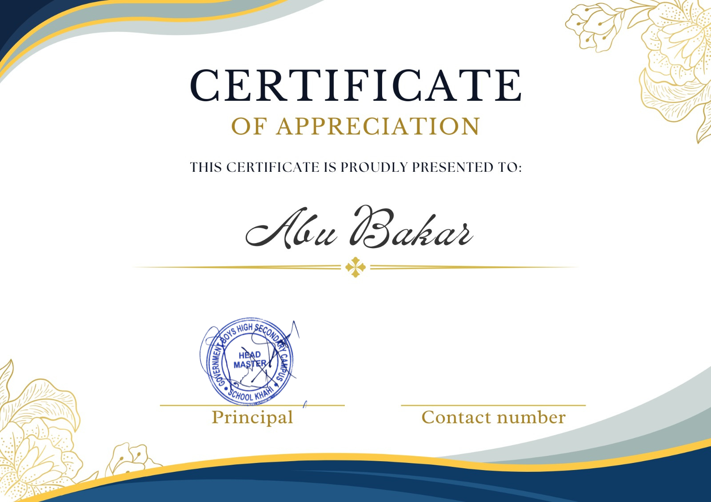

# 🕌 Project: Tariq ki Dua (Allama Iqbal Community Outreach)

Welcome to the **"Tariq ki Dua" Project** directory! This folder archives the practical community-engagement project executed as a key part of SS-102 (Iqbaliyat) under the registration number **NUM-BSCS-2022-41**.

This project translates the deep philosophical poetry of **Allama Muhammad Iqbal** into practical, real-world educational workshops targeting local school children and young adults in Mianwali.

---

## 📂 Project Archive Files

This directory contains the following project resources:

*   **📄 Research & Field Execution Report**:
    *   [Tariq_ki_Dua_Report.pdf](file:///c:/Users/abuba/OneDrive/Desktop/BS-CS-Namal-Material/Semester%207/Iqbaliyat/Iqbaliyat%20Project%20(NUM-BSCS-2022-41)/Tariq_ki_Dua_Report.pdf) — Complete academic report detailing the project scope, workshop outlines, interactive activities, target student demographics, feedback loops, and philosophical reflections.
*   **🏆 Validation Certificate**:
    *   [Certificate.png](file:///c:/Users/abuba/OneDrive/Desktop/BS-CS-Namal-Material/Semester%207/Iqbaliyat/Iqbaliyat%20Project%20(NUM-BSCS-2022-41)/Certificate.png) — Official course certification confirming successful execution of the community project.
*   **📸 Execution Gallery**:
    *   [picture 1.png](file:///c:/Users/abuba/OneDrive/Desktop/BS-CS-Namal-Material/Semester%207/Iqbaliyat/Iqbaliyat%20Project%20(NUM-BSCS-2022-41)/picture%201.png) — Workshop session teaching Iqbal's concepts of moral strength.
    *   [picture 2.png](file:///c:/Users/abuba/OneDrive/Desktop/BS-CS-Namal-Material/Semester%207/Iqbaliyat/Iqbaliyat%20Project%20(NUM-BSCS-2022-41)/picture%202.png) — Interactive student participation activity.
    *   [picture 3.png](file:///c:/Users/abuba/OneDrive/Desktop/BS-CS-Namal-Material/Semester%207/Iqbaliyat/Iqbaliyat%20Project%20(NUM-BSCS-2022-41)/picture%203.png) — Group photo with workshop attendees and educators.

---

## 📖 The Core Philosophy: "Tariq ki Dua"

The project centers around Tariq bin Ziyad's historic prayer before the Battle of Guadalete in 711 AD, as poetically reconstructed by Allama Iqbal in his masterpiece collection *Bal-e-Jibril*:

> **یہ غازی، یہ تیرے پراسرار بندے**
> **جنھیں تو نے بخشا ہے ذوقِ خدائی**
> **دو نیم ان کی ٹھوکر سے صحرا و دریا**
> **سمٹ کر پہاڑ ان کی ہیبت سے رائی**

### Themes Addressed:
1.  **Ghairat (Self-Respect & Honor)**: Teaching youth to remain steadfast and refuse sub-optimal moral compromises.
2.  **Yaqeen-e-Kamil (Unshakeable Faith)**: Harnessing internal spiritual energy and absolute conviction to overcome seemingly impossible career and personal goals.
3.  **Intellectual Independence**: Empowering regional students to think critically and challenge conventional, passive academic defaults.

---

## 🚀 Community Outreach & Project Execution

### 🎯 Target Audience
Primary and Middle school students in regional communities, aimed at instilling positive civic character, academic focus, and ethical principles from an early age.

### 🛠️ Session Architecture
*   **Part 1: Poetic Recitation**: Engaging students with synchronous recitation of *"Lab Pe Aati Hai Dua"* and *"Tariq ki Dua"* to foster literary appreciation.
*   **Part 2: Philosophical Translation**: Breaking down complex Urdu and Persian terminology (e.g., *Khudi*, *Shaheen*, *Ishq*) into clear, digestible, story-driven allegories.
*   **Part 3: Interactive Group Reflection**: Students shared their personal aspirations and discussed how to apply *Khudi* to overcome learning challenges.

---

## 🏆 Project Evidence & Gallery

### 🎓 Execution Verification
Below is the course validation certificate confirming the successful evaluation and delivery of the community field project:

### 📸 Session Highlights
A few snapshots showcasing the active classroom discussions, student engagement, and group activities conducted during the outreach campaign:

| School | Head Master | Class Room |
| :---: | :---: | :---: |
|  |  |  |

---

*This project highlights the integration of liberal arts, cultural preservation, and social leadership within Namal University's rigorous Computer Science curriculum.*
