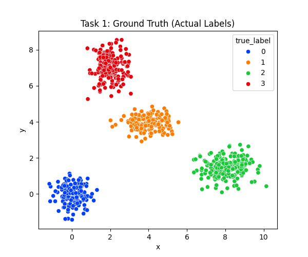
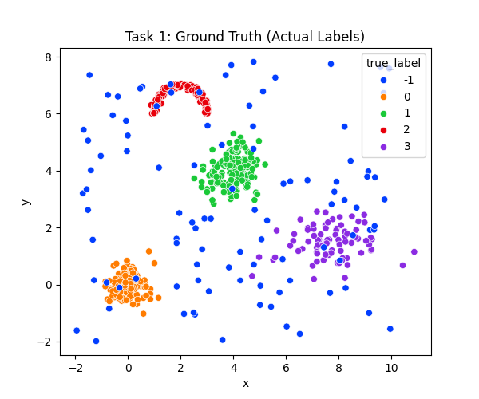
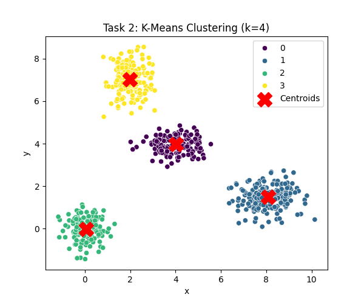
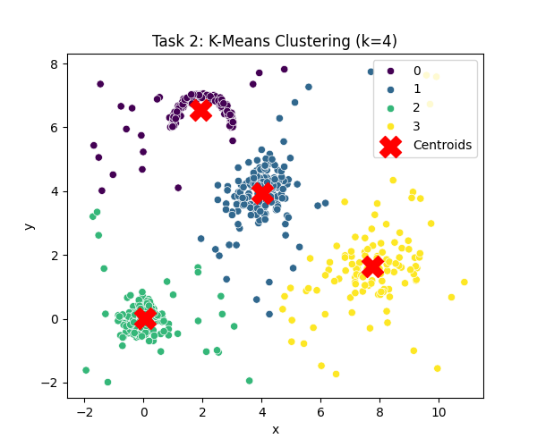
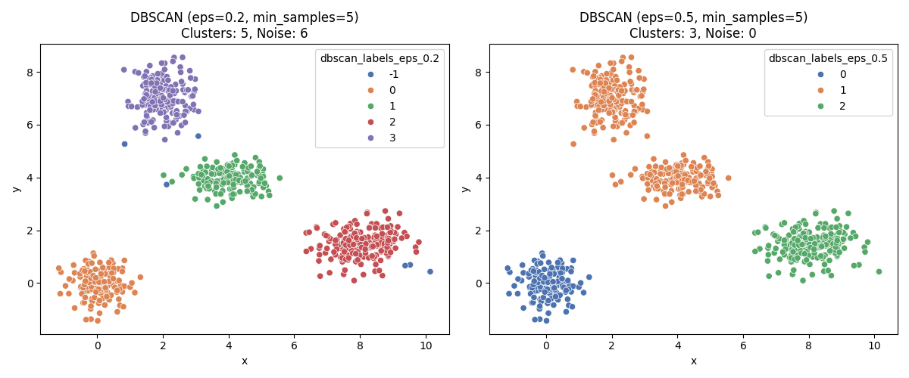
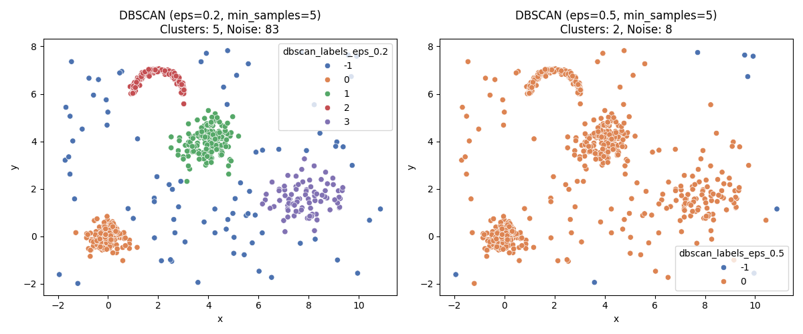
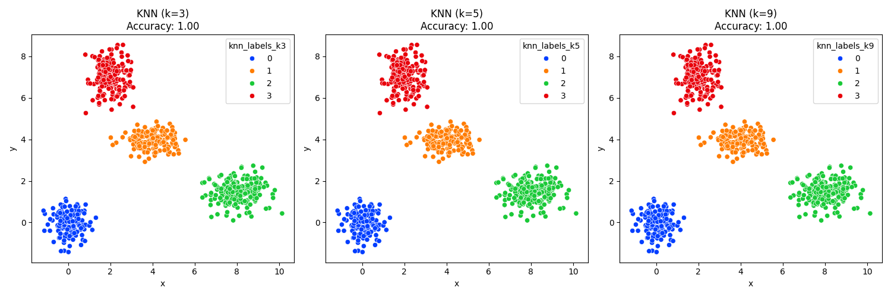
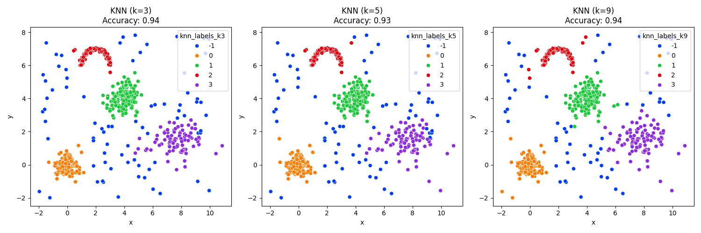

# 🤖 Assignment #01: K-Means, DBSCAN, and KNN From Scratch

Welcome to the **Assignment #01** repository! This project implements three foundational machine learning algorithms—**K-Means Clustering**, **DBSCAN (Density-Based Spatial Clustering of Applications with Noise)**, and **K-Nearest Neighbors (KNN)**—completely from scratch using only Python and Numpy. 

The task evaluates these models on two distinct synthetic datasets: a clean **convex (circularly separable)** dataset and a highly complex **noisy** dataset.

---

## 📂 Directory Contents

*   **💻 Implementation Python Scripts**:
    *   [Kmeans_BDSCAN_KNN_code_no_noise.py](./Kmeans_BDSCAN_KNN_code_no_noise.py) — Custom scripts evaluating the algorithms on the clean convex dataset.
    *   [Kmeans_DBSCAN_KNN_code_noise.py](./Kmeans_DBSCAN_KNN_code_noise.py) — Scripts optimized for handling clustering with high noise levels.
*   **📊 Input Datasets (CSV)**:
    *   `Kmeans_DBScan_KNN_convex_no_noise.csv` — 2D convex dataset representing clean cluster circles.
    *   `Kmeans_DBScan_KNN_complex_noise.csv` — Messy, non-linear dataset containing arbitrary shapes and noise points.
*   **📄 Written Reports**:
    *   [Abubakar_Assignment 01_Kmeans_DBScan_KNN_Report.pdf](./Abubakar_Assignment%2001_Kmeans_DBScan_KNN_Report.pdf) — Comprehensive, peer-reviewed evaluation report analyzing hyperparameter settings, convergence rates, and performance comparisons.
    *   [Assignment 01_Kmeans_DBScan_KNN.docx](./Assignment%2001_Kmeans_DBScan_KNN.docx) — Source assignment sheet and report drafts.
*   **📸 Output Visualization Directory**:
    *   Pre-rendered plots illustrating raw ground truth, K-Means convergence, DBSCAN density chains, and KNN decision mappings.

---

## 🧠 Algorithms Under the Hood

### 1. K-Means Clustering (Centroid-Based)
*   **Mechanics**: Custom expectation-maximization engine. Starts by initializing $K$ random centroids, iteratively assigns points to the nearest centroid using Euclidean distance, and updates the centroids until convergence is achieved.
*   **Limitation**: Struggles heavily with non-convex shapes and noise as it forces every single point into a cluster.

### 2. DBSCAN (Density-Based)
*   **Mechanics**: Traverses points to construct clusters based on spatial density parameters: `eps` (radius) and `min_samples` (threshold of core points).
*   **Key Advantage**: Handles non-linear clusters of arbitrary shape and isolates low-density outliers as custom noise points (labeled `-1`), making it highly resilient to noise.

### 3. KNN (Supervised Classifier)
*   **Mechanics**: Non-parametric classifier. Given an input query point, it calculates distances to all training samples, selects the $K$ closest neighbors, and determines the target label via majority voting.

---

## 📈 Performance Visualizations & Comparisons

Below is a side-by-side visual matrix showing how each algorithm processed the two datasets:

### Convex (No Noise) vs. Complex (With Noise)

| Method / Dataset | Convex (No Noise) | Complex (With Noise) |
| :--- | :---: | :---: |
| **Ground Truth** |  |  |
| **K-Means** |  |  |
| **DBSCAN** |  |  |
| **KNN** |  |  |

---

## 🎓 Core Insight & Findings

1.  **K-Means Vulnerability**: As observed in `Task2_KMeans_noise.png`, K-Means completely fails on complex datasets because it assumes spherical shapes, resulting in misallocated boundary borders and dragging centroids toward outliers.
2.  **DBSCAN Brilliance**: DBSCAN excels at isolating arbitrary structures (`Task3_DBSCAN_noise.png`) by ignoring scattered background points, identifying them accurately as black noise markers.
3.  **KNN Mappings**: The KNN boundaries show high classification accuracy on clean datasets but display minor over-fitting on highly noisy boundaries if $K$ is set too small.
