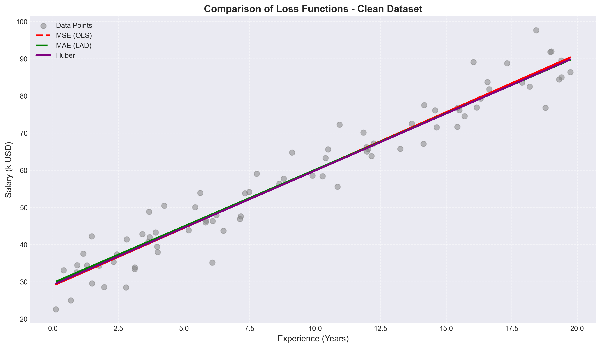
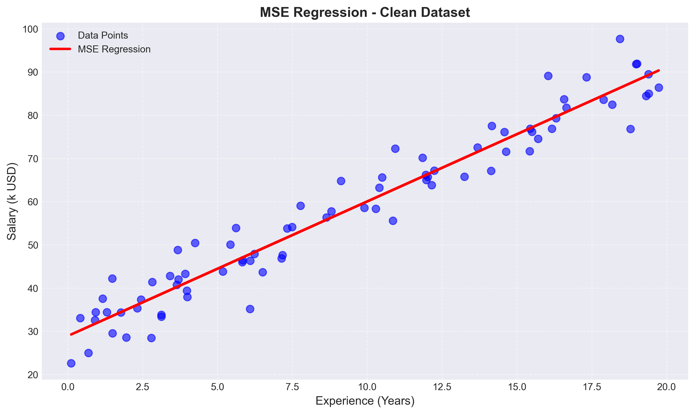
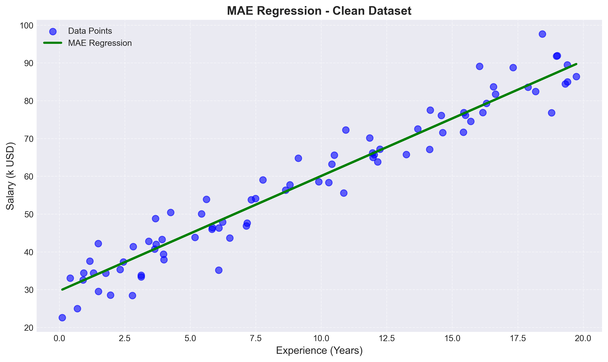
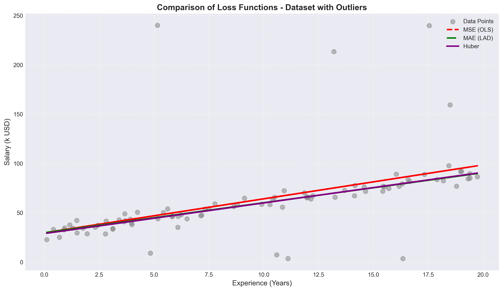
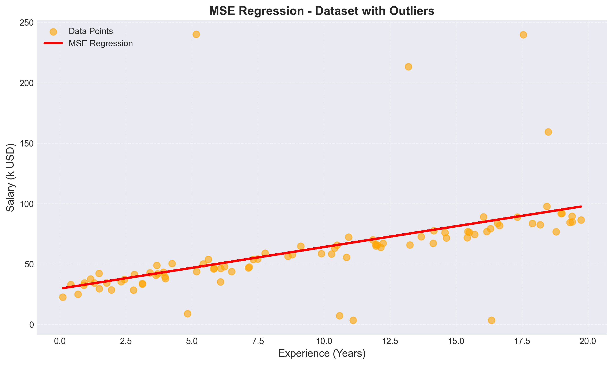
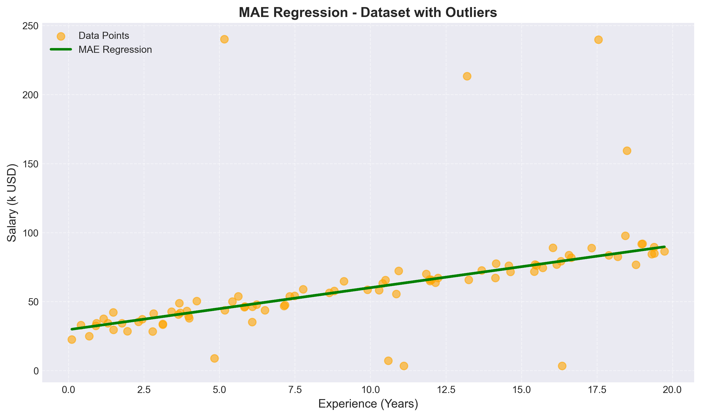

# 🤖 Assignment #02: Linear Regression & Loss Robustness (MSE vs. MAE)

Welcome to the **Assignment #02** repository! This project explores the mathematical underpinnings of **Simple Linear Regression** from scratch, with a deep-dive focus on how different loss functions—**Mean Squared Error (MSE)** and **Mean Absolute Error (MAE)**—behave in the presence of extreme dataset **outliers**.

The project uses synthetic salary-experience datasets to model professional income progression, assessing how various optimization criteria alter the final linear fit.

---

## 📂 Directory Contents

*   **💻 Custom Regression Engines**:
    *   [loss_function_analysis.py](./loss_function_analysis.py) — Core research script computing complete 3D loss grids and gradient contours for MSE & MAE.
    *   [analysis_clean.py](./analysis_clean.py) — Runs regression algorithms on the ideal outlier-free dataset.
    *   [analysis_outliers.py](./analysis_outliers.py) — Introduces high-leverage outliers and compares model shifts.
*   **📊 Salary Datasets (CSV)**:
    *   `salary_experience_clean.csv` — Baseline dataset showing strong linear correlations.
    *   `salary_experience_with_outliers.csv` — Contains engineered leverage points (outliers).
*   **📄 Written Reports**:
    *   [Abubakar(41)_Assignment_02_Report.pdf](./Abubakar%2841)_Assignment_02_Report.pdf) — Comprehensive scientific report explaining loss derivatives, mathematical convergence, and statistical insights.
    *   [Assignment 02.docx](./Assignment%2002.docx) — Source assignment outline and writeups.
*   **📸 Output Visualization Directory**:
    *   Contains comparative line plots, scatter points, 3D loss surface topography, and convergence traces.

---

## 🧠 Loss Functions: MSE vs. MAE

Simple Linear Regression fits a line $y = mx + c$ by optimizing model parameters (slope $m$, intercept $c$) using one of the following criteria:

### 1. Mean Squared Error (MSE)
$$L_{MSE}(m, c) = \frac{1}{N} \sum_{i=1}^{N} (y_i - (mx_i + c))^2$$
*   **Derivatives**: Smooth, continuous gradients. Easy to optimize using standard gradient descent.
*   **Sensitivity**: **Very High**. Squaring the error terms disproportionately penalizes large discrepancies, dragging the entire regression line toward outliers.

### 2. Mean Absolute Error (MAE)
$$L_{MAE}(m, c) = \frac{1}{N} \sum_{i=1}^{N} |y_i - (mx_i + c)|$$
*   **Derivatives**: Discontinuous gradient at zero error. Requires careful subgradient optimization or custom learning decay.
*   **Sensitivity**: **Very Low (Robust)**. Pentagonal scaling means error penalty grows only linearly, ignoring isolated distant points to focus on overall data density.

---

## 📈 Visualizing the Experimental Results

Below is a comparison of how both loss models behaved under clean vs. noisy datasets:

### 1. Outlier-Free (Clean) Dataset
On clean data, both MSE and MAE converge to almost identical, highly predictive lines:

| Clean Fit Comparison | MSE Loss Topography | MAE Loss Topography |
| :---: | :---: | :---: |
|  |  |  |

*   *Observation*: The 3D loss surfaces are smooth bowls. MSE shows a perfect paraboloid, while MAE exhibits a V-shaped crease.

### 2. Outlier-Heavy Dataset
When high-leverage outliers are introduced, MSE model shifts dramatically, while MAE stands robust:

| Outlier Fit Comparison | MSE Loss Topography | MAE Loss Topography |
| :---: | :---: | :---: |
|  |  |  |

---

## 🎓 Key Academic Takeaways

1.  **Parabolic vs. Linear Penalties**: The MSE loss function is heavily affected by outliers due to the $e^2$ penalty term. One extreme outlier can easily ruin the model's performance on the rest of the dataset.
2.  **Robust Regression**: MAE provides a superior linear fit when datasets contain measurement errors or natural anomalies, but requires modern tuning due to non-differentiable peaks at the minimum.
3.  **Visualization Significance**: Plotting the 3D parameter space ($m$, $c$ vs. Loss) exposes the learning challenges—particularly showing that MAE gradients remain constant in magnitude regardless of distance to the minimum, which can lead to oscillation without learning rate decay.
