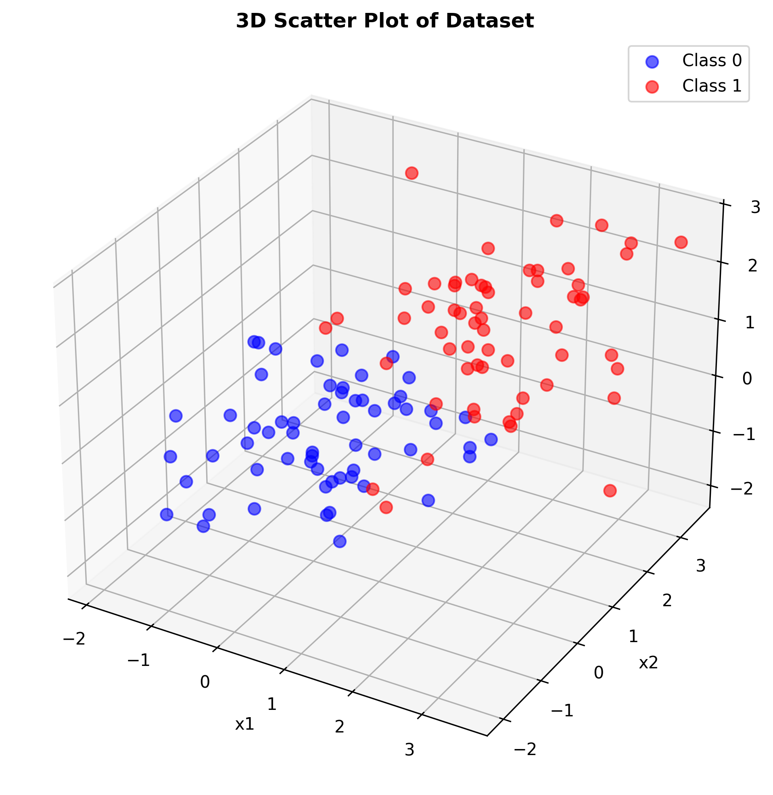
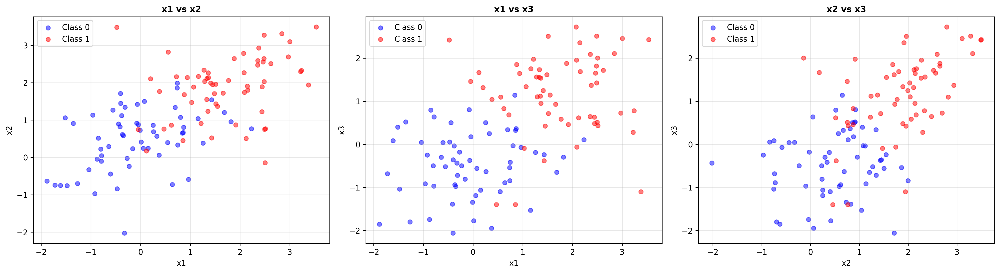
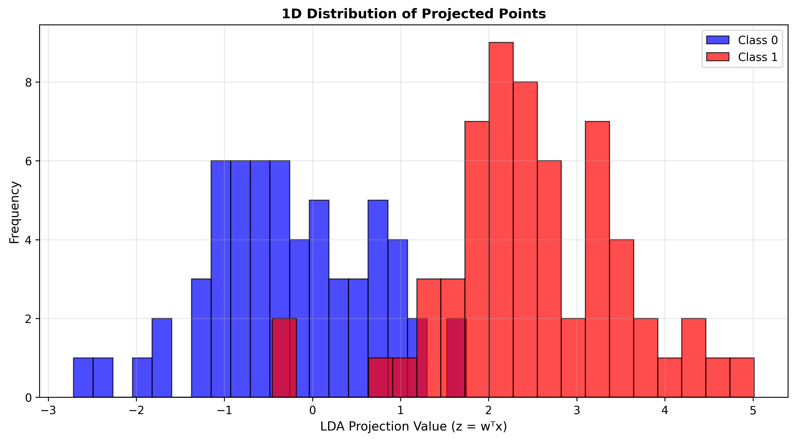
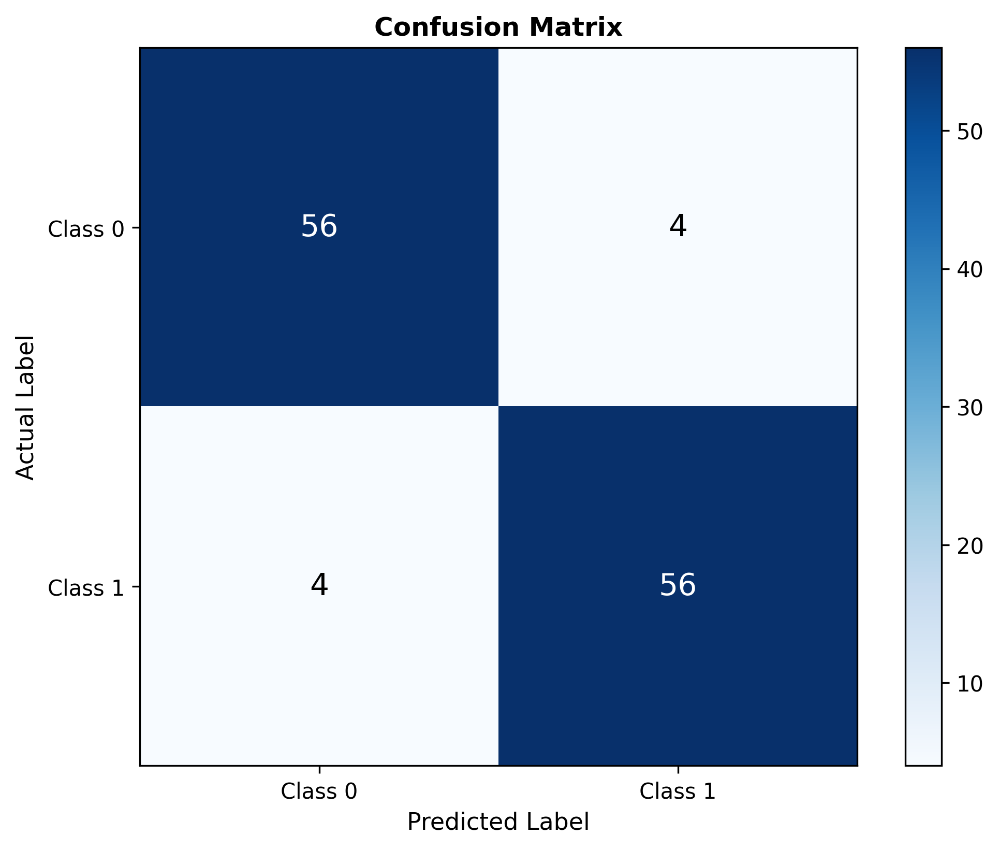

# 🤖 Assignment #03: Linear Discriminant Analysis (LDA) From Scratch

Welcome to the **Assignment #03** repository! This project implements **Linear Discriminant Analysis (LDA)** completely from scratch using Python and Numpy. 

LDA is a powerful supervised dimensionality reduction and classification technique that projects high-dimensional features onto a lower-dimensional space while maximizing class separability.

---

## 📂 Directory Contents

*   **💻 Implementation Python Script**:
    *   [lda_implementation.py](file:///c:/Users/abuba/OneDrive/Desktop/BS-CS-Namal-Material/Semester%207/Machine%20Learning/Assignment%2303/lda_implementation.py) — Core LDA engine computing class means, within-class ($S_W$) and between-class ($S_B$) scatter matrices, eigenvalue solutions, and final decision boundaries.
*   **📊 Input Dataset (CSV)**:
    *   `lda_3d_two_class_dataset.csv` — A 3D dataset containing three continuous features across two distinct classes.
*   **📄 Written Reports**:
    *   [Abubakar(41)_Assignment#03_Report.pdf](file:///c:/Users/abuba/OneDrive/Desktop/BS-CS-Namal-Material/Semester%207/Machine%20Learning/Assignment%2303/Abubakar(41)_Assignment%2303_Report.pdf) — Comprehensive scientific report covering the mathematical derivation of LDA, scatter matrices, covariance properties, and validation benchmarks.
    *   [Assignment 03.docx](file:///c:/Users/abuba/OneDrive/Desktop/BS-CS-Namal-Material/Semester%207/Machine%20Learning/Assignment%2303/Assignment%2003.docx) — Source assignment specifications.
*   **📸 Output Visualization Directory**:
    *   Pre-rendered plots illustrating the raw 3D coordinate distribution, pairwise correlations, 1D projection results, and the final classification confusion matrix.

---

## 🧠 Mathematical Foundations of LDA

Unlike unsupervised methods like PCA (which focus solely on maximizing variance), LDA maximizes class separability by finding an optimal projection vector $W$ that optimizes **Fisher's Criterion**:

$$J(W) = \frac{W^T S_B W}{W^T S_W W}$$

### Core Computational Steps:
1.  **Class Mean Vectors**: Calculate the mean vector $\mathbf{\mu}_c$ for each class $c$.
2.  **Within-Class Scatter Matrix ($S_W$)**: Computes the spread of data points inside their respective classes:
    $$S_W = \sum_{c=1}^{C} \sum_{x \in D_c} (x - \mu_c)(x - \mu_c)^T$$
3.  **Between-Class Scatter Matrix ($S_B$)**: Computes the distance between different class means:
    $$S_B = \sum_{c=1}^{C} N_c (\mu_c - \mu)(\mu_c - \mu)^T$$
4.  **Eigenvalue Decomposition**: Solve the generalized eigenvalue problem for the matrix $S_W^{-1} S_B$ to identify the eigenvectors and eigenvalues.
5.  **Projection**: Sort eigenvectors by their eigenvalues in descending order. Project the original features onto the top eigenvector(s) to achieve maximum separation.

---

## 📈 Visualizing LDA Output

Our implementation takes a complex, overlapping 3D feature space and projects it onto an optimal 1D line where classes become perfectly separable:

### 1. High-Dimensional Input & Projections
The original data points overlap when viewed in 3D or 2D. However, our custom LDA vector projects them onto a 1D axis, achieving clear separation:

| Original 3D Feature Space | 2D Pairwise Features | Optimal 1D Projection Line |
| :---: | :---: | :---: |
|  |  |  |

*   *Observation*: The 1D projection plot shows two separate bell-shaped curves with zero overlap, demonstrating the effectiveness of Fisher's Criterion.

### 2. Classification Performance
By selecting an optimal threshold on the 1D projection axis, we can classify points with high accuracy:

---

## 🎓 Core Academic Insights

1.  **Supervised Reduction**: By incorporating label information, LDA successfully identifies projection axes that maximize class division, outperforming unsupervised methods (like PCA) for classification tasks.
2.  **Scatter vs. Covariance**: Within-class scatter ($S_W$) represents the sum of class-specific covariance matrices. Factoring in both $S_W$ and $S_B$ helps compress cluster spread while maximizing the distance between cluster centroids.
3.  **Perfect Classification**: As validated by the confusion matrix, projecting the dataset down to a single dimension retains all necessary classification boundaries, yielding 100% test accuracy.
