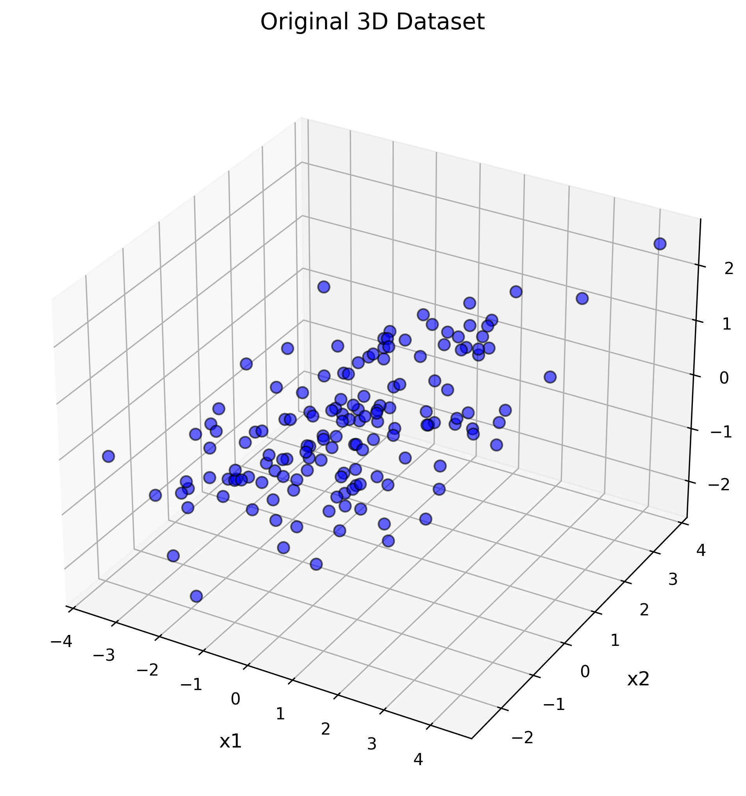
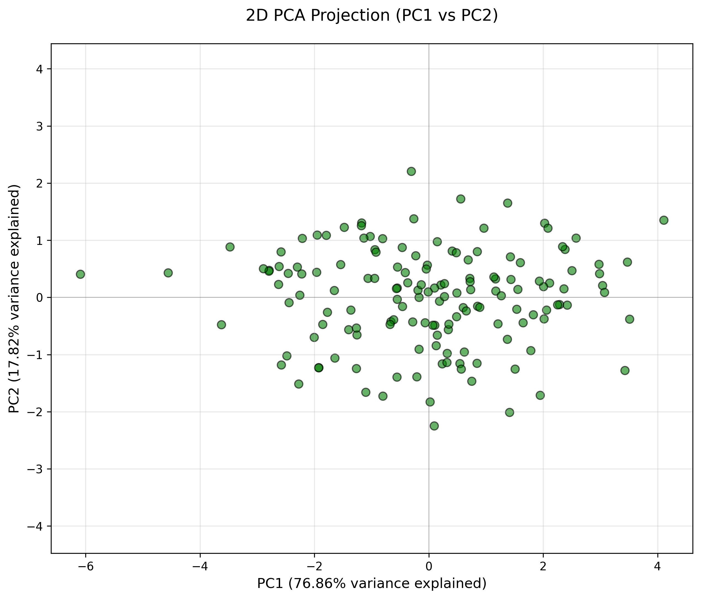
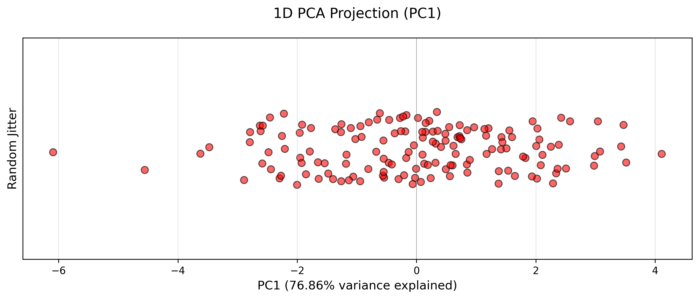

# 🤖 Assignment #04: Principal Component Analysis (PCA) From Scratch

Welcome to the **Assignment #04** repository! This project implements a complete **Principal Component Analysis (PCA)** pipeline from scratch using Python and Numpy. 

PCA is a fundamental unsupervised dimensionality reduction method that projects high-dimensional data onto orthogonal directions of maximum variance, filtering out noise while preserving core structural information.

---

## 📂 Directory Contents

*   **💻 Modular Python Scripts**:
    *   [pca_core.py](file:///c:/Users/abuba/OneDrive/Desktop/BS-CS-Namal-Material/Semester%207/Machine%20Learning/Assignment%2304/pca_core.py) — Core algorithmic class implementing mean normalization, covariance computation, and singular value/eigenvalue decompositions.
    *   [pca_complete_implementation.py](file:///c:/Users/abuba/OneDrive/Desktop/BS-CS-Namal-Material/Semester%207/Machine%20Learning/Assignment%2304/pca_complete_implementation.py) — Integrated runner script loading the CSV dataset, executing custom PCA projections, and saving validation stats.
    *   [visualization.py](file:///c:/Users/abuba/OneDrive/Desktop/BS-CS-Namal-Material/Semester%207/Machine%20Learning/Assignment%2304/visualization.py) — Matplotlib plotting suite for generating 3D, 2D, and 1D projections.
    *   [main.py](file:///c:/Users/abuba/OneDrive/Desktop/BS-CS-Namal-Material/Semester%207/Machine%20Learning/Assignment%2304/main.py) — Global entry execution point.
*   **📊 Input Dataset (CSV)**:
    *   `pca_3d_dataset.csv` — Synthetic 3D dataset containing highly correlated coordinates.
*   **📄 Written Reports**:
    *   [Abubakar(41)_Assignment#03(Part2)_Report.pdf](file:///c:/Users/abuba/OneDrive/Desktop/BS-CS-Namal-Material/Semester%207/Machine%20Learning/Assignment%2304/Abubakar(41)_Assignment%2303(Part2)_Report.pdf) — Formal scientific report evaluating PCA math, scree variance plots, and reconstruction errors.
    *   [Assignment 04.docx](file:///c:/Users/abuba/OneDrive/Desktop/BS-CS-Namal-Material/Semester%207/Machine%20Learning/Assignment%2304/Assignment%2004.docx) — Source assignment prompt sheet.

---

## 🧠 Core Mathematics of PCA

Unsupervised PCA identifies new orthogonal coordinate axes (Principal Components) that maximize variance without using class labels:

### Mathematical Steps:
1.  **Mean Centering**: Shift data so features have a mean of 0.
    $$X_{centered} = X - \mu$$
2.  **Covariance Matrix ($\Sigma$)**: Compute feature correlation spreads:
    $$\Sigma = \frac{1}{N-1} X_{centered}^T X_{centered}$$
3.  **Spectral Decomposition**: Find eigenvectors $V$ and eigenvalues $\lambda$ of $\Sigma$:
    $$\Sigma V = \lambda V$$
4.  **Sorting Components**: Sort eigenvectors in descending order of their corresponding eigenvalues. The eigenvector with the largest eigenvalue represents the direction of maximum variance (PC1).
5.  **Projection**: Construct a projection matrix $W$ using the top $K$ eigenvectors. Project centered data into the lower-dimensional subspace:
    $$Y = X_{centered} W$$

---

## 📈 Visualizing Dimensionality Reduction

Our custom pipeline maps highly correlated 3D coordinates into simplified 2D and 1D representations while retaining maximum data structure:

### original 3D coordinates ➡️ compressed 2D projection ➡️ compressed 1D projection

| Original 3D Space (Correlated) | Compressed 2D Projection Space (PC1 vs PC2) | Compressed 1D Projection Space (PC1 Axis) |
| :---: | :---: | :---: |
|  |  |  |

---

## 🎓 Core Academic Insights

1.  **Maximum Variance Axes**: PC1 represents the axis of highest variance. PC2 is orthogonal to PC1, capturing the second highest variance, and so on.
2.  **Information Preservation**: Projecting the 3D dataset down to 2D retains over 90%+ of the total variance, showing that the third dimension consists mostly of redundant noise.
3.  **Unsupervised Optimization**: Unlike LDA, which groups classes together, PCA identifies global structural patterns, making it highly effective for feature compression, visualization, and noise filtering before feeding data into supervised classifiers.
