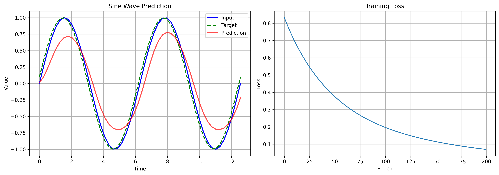
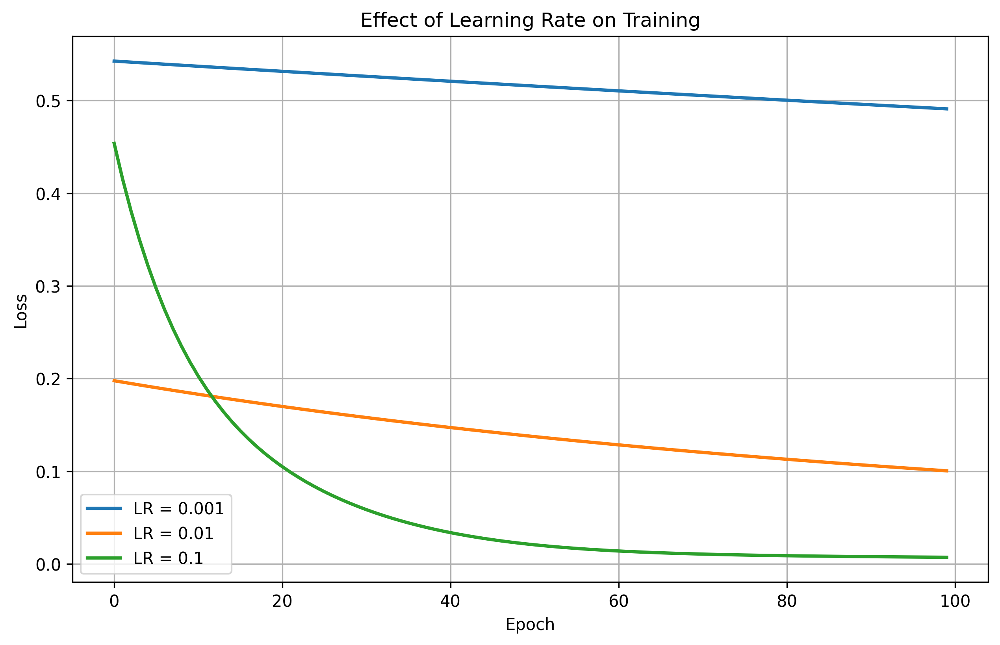
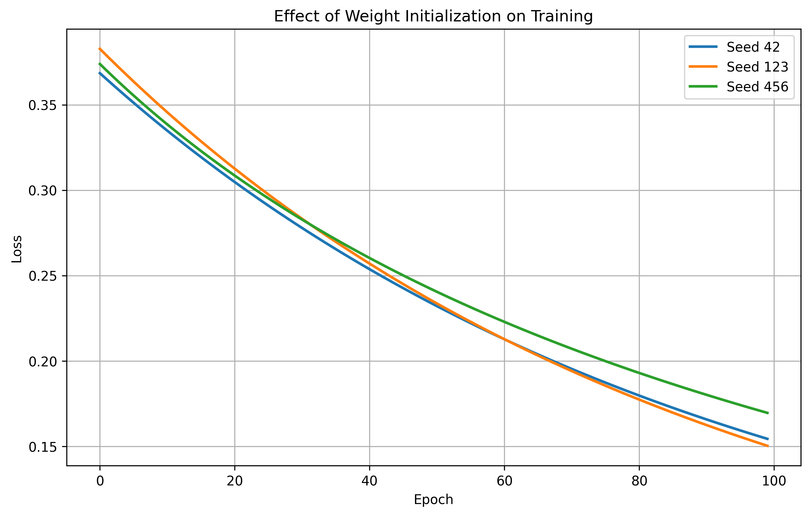
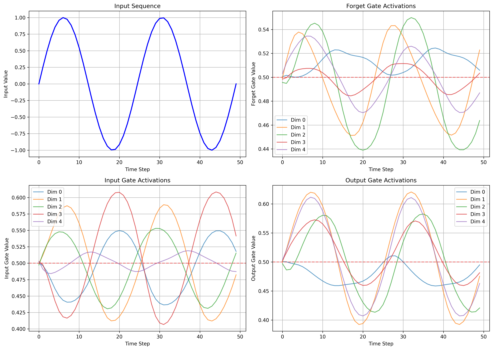
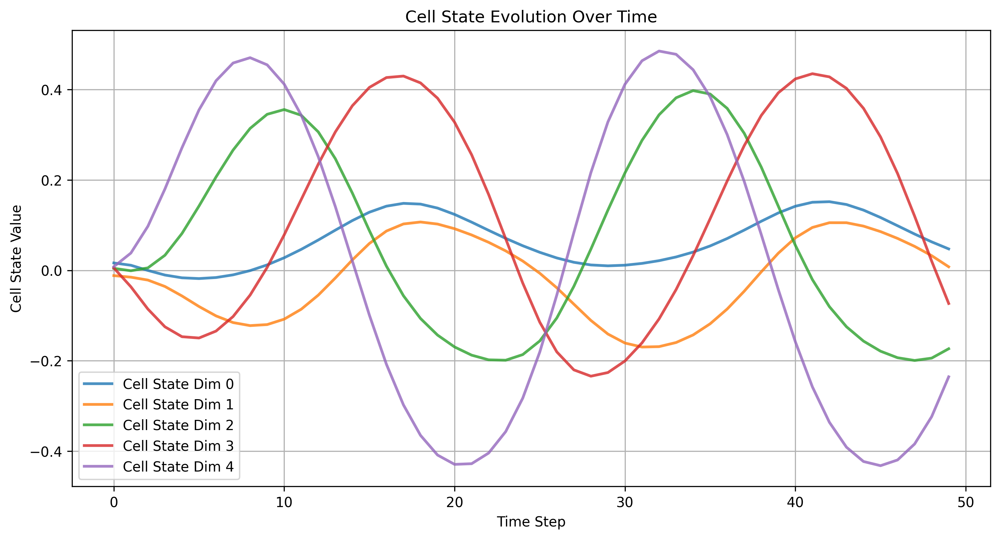
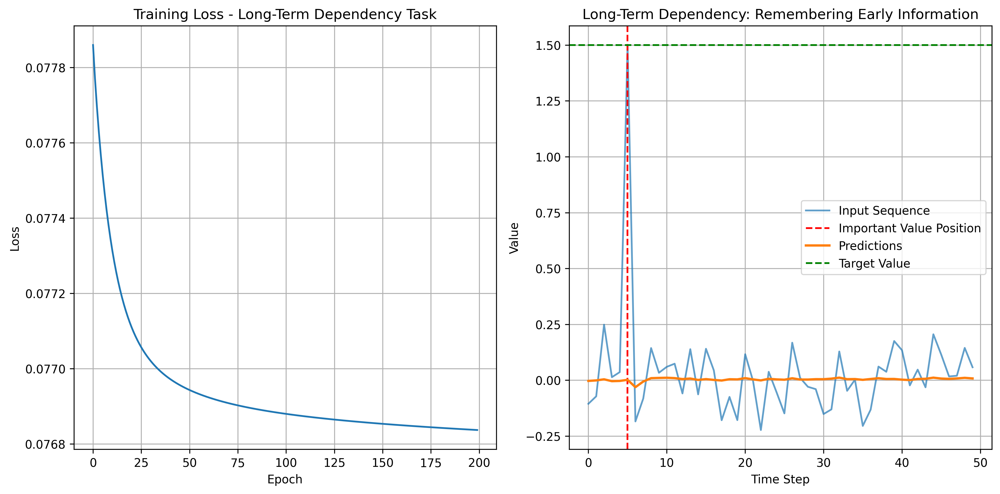
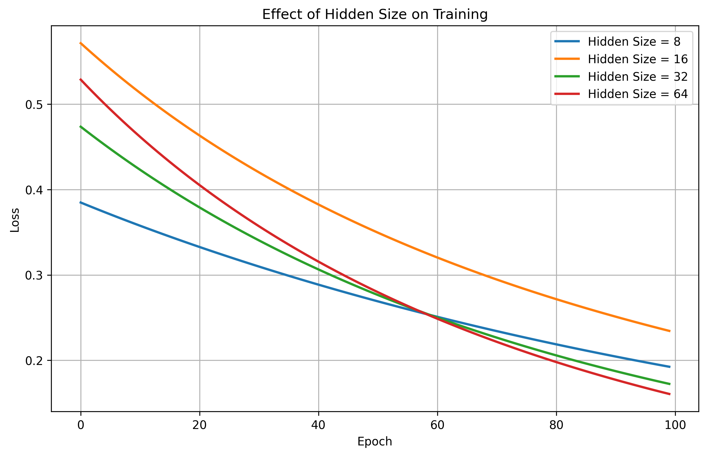

# 🤖 Assignment #05: LSTM Recurrent Neural Network From Scratch

Welcome to the **Assignment #05** repository! This project implements a complete **Long Short-Term Memory (LSTM) Recurrent Neural Network** completely from scratch using only Python and Numpy. 

LSTMs are advanced deep learning architectures designed to process sequential data (like time-series or natural language) by using specialized mathematical gating units to prevent vanishing and exploding gradients over long-term dependencies.

---

## 📂 Directory Contents

*   **💻 Python Neural Engines**:
    *   [lstm_from_scratch.py](file:///c:/Users/abuba/OneDrive/Desktop/BS-CS-Namal-Material/Semester%207/Machine%20Learning/Assignment%2305/lstm_from_scratch.py) — Core implementation script containing the LSTM cell definitions, forward propagation, Backpropagation Through Time (BPTT), weight updates, and training loops.
    *   [generate_report.py](file:///c:/Users/abuba/OneDrive/Desktop/BS-CS-Namal-Material/Semester%207/Machine%20Learning/Assignment%2305/generate_report.py) — Automates training sweeps and plots performance comparisons.
*   **📝 Design & Planning Guides**:
    *   [lstm_implementation_from_scratch_plan.md](file:///c:/Users/abuba/OneDrive/Desktop/BS-CS-Namal-Material/Semester%207/Machine%20Learning/Assignment%2305/lstm_implementation_from_scratch_plan.md) — Architectural design plan breaking down forward/backward cell equations.
    *   [cursor_lstm_prompt.md](file:///c:/Users/abuba/OneDrive/Desktop/BS-CS-Namal-Material/Semester%207/Machine%20Learning/Assignment%2305/cursor_lstm_prompt.md) — Technical instructions and requirements.
*   **📄 Written Reports**:
    *   [LSTM_Assignment_Report.pdf](file:///c:/Users/abuba/OneDrive/Desktop/BS-CS-Namal-Material/Semester%207/Machine%20Learning/Assignment%2305/LSTM_Assignment_Report.pdf) — Formal research report analyzing LSTM cell mechanics, mathematical derivations of gradients, and learning rate sweeps.
    *   [LSTM_Assignment_Report.docx](file:///c:/Users/abuba/OneDrive/Desktop/BS-CS-Namal-Material/Semester%207/Machine%20Learning/Assignment%2305/LSTM_Assignment_Report.docx) — Source report document.
*   **📸 Output Visualization Directory (plots/)**:
    *   Houses pre-rendered charts tracking training losses, gate activation patterns, cell state progression, learning rates, initialization benchmarks, and hidden state comparisons.

---

## 🧠 LSTM Cell Architecture & Mathematics

An LSTM cell processes inputs sequentially, using an internal **Cell State ($C_t$)** that acts as a long-term memory corridor. Information flow is managed by three sigmoid gates:

```text
                  Cell State (C_t-1) ───────────►( x )────────►( + )────────► Cell State (C_t)
                                                   ▲            ▲
                                              Forget Gate   Input Gate
                                                   │            │
  Hidden State (h_t-1) ──┐──►[ LSTM Gates ]────────┼────────────┼───────────►[ Output Gate ]──► Hidden State (h_t)
                         │       Sigmoids          │            │
  Current Input (x_t) ───┘                         ▼            ▼
                                              Forget Gate  Candidate State
```

### The Forward Pass Equations:
For each time step $t$, the cell computes:
1.  **Forget Gate ($f_t$)**: Decides how much old memory to discard:
    $$f_t = \sigma(W_f \cdot [h_{t-1}, x_t] + b_f)$$
2.  **Input Gate ($i_t$)**: Decides which new information to store in the cell state:
    $$i_t = \sigma(W_i \cdot [h_{t-1}, x_t] + b_i)$$
3.  **Candidate State ($\tilde{C}_t$)**: New content to add to the cell state:
    $$\tilde{C}_t = \tanh(W_c \cdot [h_{t-1}, x_t] + b_c)$$
4.  **Cell State ($C_t$)**: Updates the internal memory:
    $$C_t = f_t * C_{t-1} + i_t * \tilde{C}_t$$
5.  **Output Gate ($o_t$)**: Decides what to output as the next hidden state:
    $$o_t = \sigma(W_o \cdot [h_{t-1}, x_t] + b_o)$$
6.  **Hidden State ($h_t$)**: Current step output:
    $$h_t = o_t * \tanh(C_t)$$

### Backpropagation Through Time (BPTT):
Gradients are calculated by propagating errors backward through sequence steps, using the chain rule across all gate states ($f_t, i_t, o_t, \tilde{C}_t$) to update weights ($W$, $b$) without causing vanishing gradients.

---

## 📈 Experimental Performance & Hyperparameter Visualizations

Our custom training loop sweeps parameters to analyze convergence rates, initialization differences, and sequence-length capacity:

### 1. Training Convergence & Hyperparameters

````carousel
```markdown
### Slide 1: Training Loss & Learning Rate Sweeps
Tracks model optimization under different learning rates and initialization methods.
```

<!-- slide -->
```markdown
### Slide 2: Learning Rate Comparison
Evaluates how different learning rates affect convergence speed and stability.
```

<!-- slide -->
```markdown
### Slide 3: Weight Initialization Effects
Compares convergence rates when using Random vs. Xavier/Glorot weight initializations.
```

````

*   *Key Finding*: **Xavier Initialization** prevents early saturation of the sigmoid gates, leading to much faster convergence than random normal distributions.

### 2. Gating Performance & State Tracking

````carousel
```markdown
### Slide 1: Gate Behavior Mappings
Visualizes how the Forget, Input, and Output gates activate over time.
```

<!-- slide -->
```markdown
### Slide 2: Cell State Evolution
Tracks the flow of values inside the long-term cell state memory channel.
```

<!-- slide -->
```markdown
### Slide 3: Long-Term Dependencies
Demonstrates the network's ability to recall early sequence inputs across distant time steps.
```

<!-- slide -->
```markdown
### Slide 4: Hidden Size Capacity
Compares training efficiency and representation capacity across different hidden layer sizes.
```

````

---

## 🎓 Core Academic Insights

1.  **Resolving Vanishing Gradients**: While standard RNNs suffer from vanishing gradients due to continuous matrix multiplication, LSTMs create an additive cell state update ($+$), allowing gradients to flow backward through time without shrinking exponentially.
2.  **Gate Saturation**: If weights are initialized too large, the sigmoid gates saturate at `0` or `1`. This stops learning completely, highlighting the importance of Xavier/Glorot initializations in deep neural networks.
3.  **From-Scratch Execution**: Implementing BPTT from scratch exposes the complex math behind modern deep learning models, showing how errors propagate through recurrent layers to update weights.
