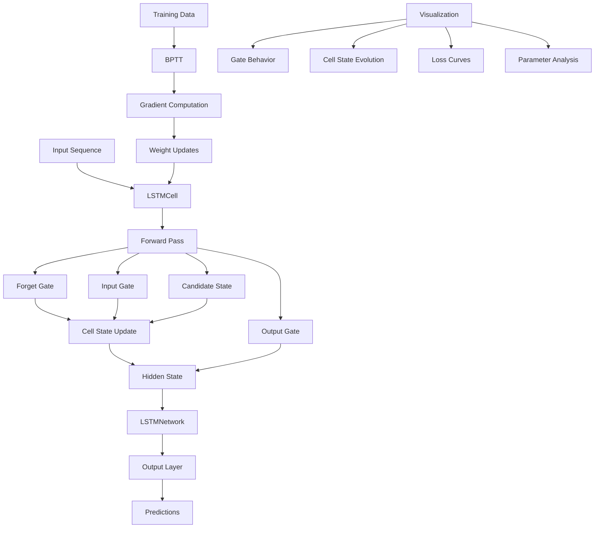

# LSTM Implementation from Scratch - Implementation Plan

## Overview

This plan implements a complete LSTM network from scratch using only NumPy and Matplotlib, following the exact mathematical equations specified in the assignment. The implementation will include training, visualization, analysis, and automated report generation.

## Architecture Overview



## Implementation Components

### 1. Core LSTM Implementation (`lstm_from_scratch.py`)

#### 1.1 LSTMCell Class

- **Initialization**: Xavier/He weight initialization for all gate weights (W_f, W_i, W_c, W_o) and biases
- **Activation Functions**: Implement sigmoid and tanh from scratch using NumPy
- **Forward Pass**: Step-by-step computation of all gates following exact equations:
  - Concatenate `[h_prev, x_t]`
  - Compute forget gate: `f_t = σ(W_f · concat + b_f)`
  - Compute input gate: `i_t = σ(W_i · concat + b_i)`
  - Compute candidate: `c̃_t = tanh(W_c · concat + b_c)`
  - Update cell state: `c_t = f_t ⊙ c_prev + i_t ⊙ c̃_t`
  - Compute output gate: `o_t = σ(W_o · concat + b_o)`
  - Compute hidden state: `h_t = o_t ⊙ tanh(c_t)`
- **Forward Sequence**: Process entire sequences, storing all intermediate states

#### 1.2 LSTMNetwork Class

- **Architecture**: LSTMCell + output layer (linear transformation)
- **Training**: Backpropagation Through Time (BPTT) implementation
  - Forward pass through sequence
  - Loss computation (MSE for regression, cross-entropy for classification)
  - Backward pass computing gradients
  - Weight updates using learning rate
- **Prediction**: Forward pass for inference

#### 1.3 Demonstration Functions

- **`demonstrate_long_term_dependencies()`**: 
  - Create sequence task requiring long-term memory (e.g., delayed signal detection)
  - Show LSTM can remember information from early timesteps
  - Compare with theoretical RNN limitations

- **`visualize_gate_behavior()`**:
  - Plot forget gate, input gate, output gate activations over time
  - Visualize cell state evolution
  - Show how gates control information flow

- **`parameter_sensitivity_analysis()`**:
  - Test learning rates: [0.001, 0.01, 0.1]
  - Test weight initializations: Xavier, He, random normal
  - Test hidden sizes: [8, 16, 32, 64]
  - Generate comparison plots

#### 1.4 Main Execution

- **Example 1**: Sine wave prediction (time series)
- **Example 2**: Long-term dependency task
- **Example 3**: Gate behavior visualization
- **Example 4**: Parameter sensitivity analysis
- Save all plots to `plots/` directory

### 2. Report Generation (`generate_report.py`)

Using `python-docx` library to programmatically create the Word document:

#### 2.1 Document Structure

- **Title Page**: Assignment title, university info, student details (Abu Bakar, NUM-BSCS-2022-41), date
- **Table of Contents**: Auto-generated with page numbers
- **10 Main Sections**: As specified in prompt
- **Appendix**: Complete code listing

#### 2.2 Content Generation

- Extract code snippets from implementation
- Include generated plots as images
- Format equations using Word equation editor syntax
- Apply formatting: Times New Roman 12pt, 1.5 spacing, 1" margins

### 3. Project Structure

```
Assignment/
├── lstm_from_scratch.py          # Main implementation
├── generate_report.py             # Report generation script
├── LSTM_Assignment_Report.docx    # Generated report
├── plots/                         # Generated visualizations
│   ├── training_loss.png
│   ├── gate_behavior.png
│   ├── cell_state_evolution.png
│   ├── long_term_dependency.png
│   ├── learning_rate_comparison.png
│   ├── initialization_comparison.png
│   └── hidden_size_comparison.png
├── requirements.txt               # Dependencies (numpy, matplotlib, python-docx)
└── cursor_lstm_prompt.md          # Assignment prompt
```

## Implementation Details

### Key Technical Decisions

1. **Weight Initialization**: Xavier initialization for sigmoid gates, He initialization for tanh gates
2. **Gradient Clipping**: Implement gradient clipping to prevent exploding gradients
3. **Loss Function**: MSE for regression tasks, cross-entropy for classification
4. **Sequence Padding**: Handle variable-length sequences if needed
5. **Reproducibility**: Set `np.random.seed()` for consistent results

### Backpropagation Through Time (BPTT)

- Unroll LSTM over sequence length
- Compute gradients for each timestep
- Accumulate gradients across timesteps
- Update weights using accumulated gradients
- Implement truncated BPTT if sequences are very long

### Visualization Strategy

- Use matplotlib subplots for multi-panel figures
- Color-code gates for clarity
- Include legends and axis labels
- Save high-resolution figures (300 DPI) for report inclusion

## Dependencies

- `numpy`: Matrix operations and mathematical functions
- `matplotlib`: All visualizations
- `python-docx`: Word document generation

## Testing & Validation

1. **Unit Tests**: Verify each gate computation matches expected output
2. **Integration Tests**: Test forward pass on known sequences
3. **Gradient Check**: Verify backpropagation correctness
4. **Visual Inspection**: Ensure plots are meaningful and interpretable

## Report Content Strategy

The report will be generated programmatically with:

- Theoretical explanations written in code
- Code snippets extracted from implementation
- Plots automatically inserted
- Equations formatted using Word equation syntax
- Student information: Abu Bakar (NUM-BSCS-2022-41)

## Execution Order

1. Implement `LSTMCell` class with all gate computations
2. Implement `LSTMNetwork` class with training loop
3. Create demonstration functions
4. Test implementation on simple sequences
5. Run all demonstrations and generate plots
6. Create report generation script
7. Generate Word document with all content
8. Validate report formatting and completeness

## Notes

- Student Information:
  - Name: Abu Bakar
  - Registration Number: NUM-BSCS-2022-41
- All code will be thoroughly commented and documented
- Random seeds will be set for reproducibility
- Plots will be saved automatically during execution